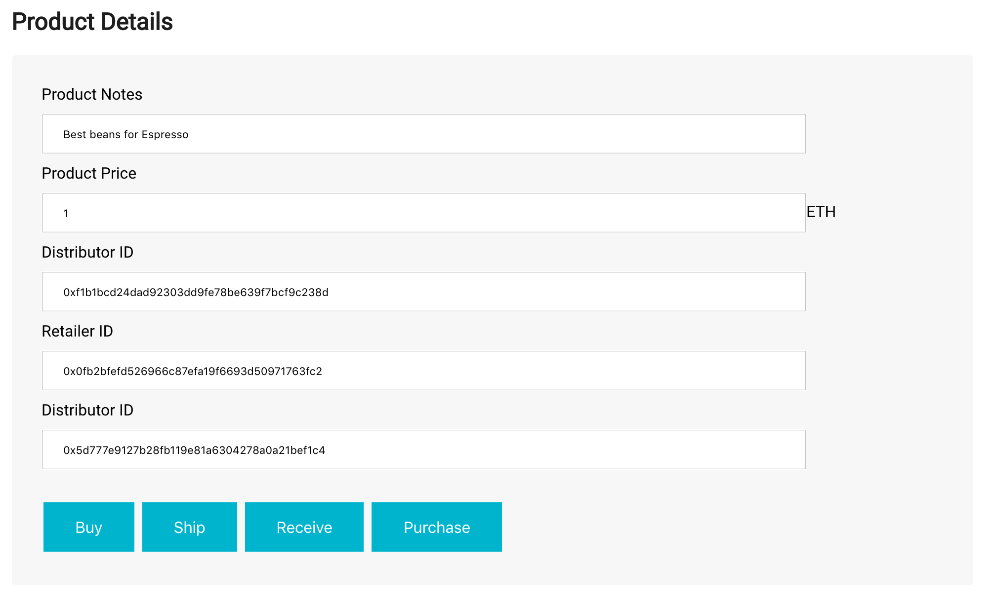

# Coffee Supply Chain

## UML Diagrams

### UML Activity Diagram


### UML Class Diagram


### UML Sequence Diagram


### UML State Diagram


## Versions used

- Truffle v5.4.25 (core: 5.4.25)
- Solidity - 0.8.11 (solc-js)
- Node v14.18.1
- Web3.js v1.5.3

## Hashes and addresses

- Contract address: [`0x7cA764c0E996BAcF876d2d07728e641f8BE4f799`](https://rinkeby.etherscan.io/address/0x7cA764c0E996BAcF876d2d07728e641f8BE4f799)
- Deployment Tx: [`0x8e9b8e43075c74dcd623f1fa814108298a7863bceefe8dcafe512e9be773955e`](https://rinkeby.etherscan.io/tx/0x8e9b8e43075c74dcd623f1fa814108298a7863bceefe8dcafe512e9be773955e)
- UI is deployed on IPFS: https://ipfs.io/ipfs/QmYAPGWVRLSUx5imWybnEwkFaRz4Q43yXm6zjyeuimjaSR
- Transaction History:
  - Harvested - [`0x1f4c6ec5bb79b53ea55546d1fa6cc6dd6e76ab3ecbf7b25af204530d840c759f`](https://rinkeby.etherscan.io/tx/0x1f4c6ec5bb79b53ea55546d1fa6cc6dd6e76ab3ecbf7b25af204530d840c759f)
  - Processed - [`0xe1bd5474113ee0a4d7922db2c6d620ec55219e163dfc2030621a98d53f3e6561`](https://rinkeby.etherscan.io/tx/0xe1bd5474113ee0a4d7922db2c6d620ec55219e163dfc2030621a98d53f3e6561)
  - Packed - [`0x1361e9e2c3f451a1a542f1281287924b49aa0a0702bd3c8bbe57346882eede62`](https://rinkeby.etherscan.io/tx/0x1361e9e2c3f451a1a542f1281287924b49aa0a0702bd3c8bbe57346882eede62)
  - ForSale - [`0x949d5e023d4b8969fbe48871af17ac681add30d24e749bffbc6f8e1cbdbe6adc`](https://rinkeby.etherscan.io/tx/0x949d5e023d4b8969fbe48871af17ac681add30d24e749bffbc6f8e1cbdbe6adc)
  - Sold - [`0x6bf374100a20e9a010e7df4135b7ea6f3dc2b506a3a44ab35d4c213994722a8b`](https://rinkeby.etherscan.io/tx/0x6bf374100a20e9a010e7df4135b7ea6f3dc2b506a3a44ab35d4c213994722a8b)
  - Shipped - [`0xf5a306e8cb58a5cb12468f35ec05b569e169950ed2e7d174854e99765c84dc4b`](https://rinkeby.etherscan.io/tx/0xf5a306e8cb58a5cb12468f35ec05b569e169950ed2e7d174854e99765c84dc4b)
  - Received - [`0xc31f34d961bdf93e2fbe629020249fdda419c66635f968154366a4c9617cfa21`](https://rinkeby.etherscan.io/tx/0xc31f34d961bdf93e2fbe629020249fdda419c66635f968154366a4c9617cfa21)
  - Purchased - [`0xced5ab61aeb3a47e30d2d2850fb4bb19a37163648cf2c0a83befcd6c07ab9365`](https://rinkeby.etherscan.io/tx/0xced5ab61aeb3a47e30d2d2850fb4bb19a37163648cf2c0a83befcd6c07ab9365)


<details>
<summary>Expand/Collapse starter code README</summary>

# Supply chain & data auditing

This repository containts an Ethereum DApp that demonstrates a Supply Chain flow between a Seller and Buyer. The user story is similar to any commonly used supply chain process. A Seller can add items to the inventory system stored in the blockchain. A Buyer can purchase such items from the inventory system. Additionally a Seller can mark an item as Shipped, and similarly a Buyer can mark an item as Received.

The DApp User Interface when running should look like...





## Getting Started

These instructions will get you a copy of the project up and running on your local machine for development and testing purposes. See deployment for notes on how to deploy the project on a live system.

### Prerequisites

Please make sure you've already installed ganache-cli, Truffle and enabled MetaMask extension in your browser.

```
Give examples (to be clarified)
```

### Installing

> The starter code is written for **Solidity v0.4.24**. At the time of writing, the current Truffle v5 comes with Solidity v0.5 that requires function _mutability_ and _visibility_ to be specified (please refer to Solidity [documentation](https://docs.soliditylang.org/en/v0.5.0/050-breaking-changes.html) for more details). To use this starter code, please run `npm i -g truffle@4.1.14` to install Truffle v4 with Solidity v0.4.24.

A step by step series of examples that tell you have to get a development env running

Clone this repository:

```
git clone https://github.com/udacity/nd1309/tree/master/course-5/project-6
```

Change directory to `project-6` folder and install all requisite npm packages (as listed in `package.json`):

```
cd project-6
npm install
```

Launch Ganache:

```
ganache-cli -m "spirit supply whale amount human item harsh scare congress discover talent hamster"
```

Your terminal should look something like this:


In a separate terminal window, Compile smart contracts:

```
truffle compile
```

Your terminal should look something like this:


This will create the smart contract artifacts in folder `build\contracts`.

Migrate smart contracts to the locally running blockchain, ganache-cli:

```
truffle migrate
```

Your terminal should look something like this:


Test smart contracts:

```
truffle test
```

All 10 tests should pass.


In a separate terminal window, launch the DApp:

```
npm run dev
```

## Built With

- [Ethereum](https://www.ethereum.org/) - Ethereum is a decentralized platform that runs smart contracts
- [IPFS](https://ipfs.io/) - IPFS is the Distributed Web | A peer-to-peer hypermedia protocol
  to make the web faster, safer, and more open.
- [Truffle Framework](http://truffleframework.com/) - Truffle is the most popular development framework for Ethereum with a mission to make your life a whole lot easier.

## Authors

See also the list of [contributors](https://github.com/your/project/contributors.md) who participated in this project.

## Acknowledgments

- Solidity
- Ganache-cli
- Truffle
- IPFS

</details>
